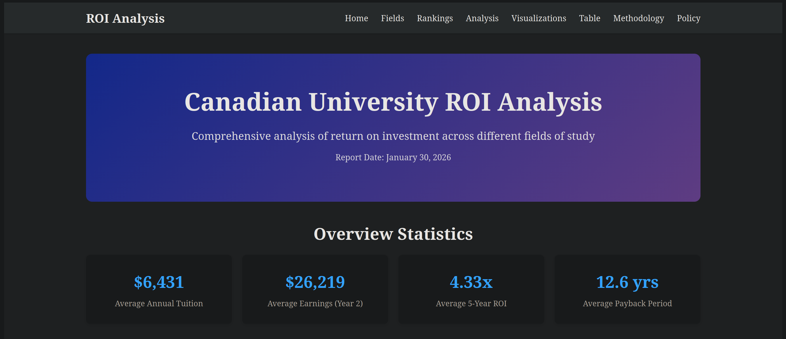
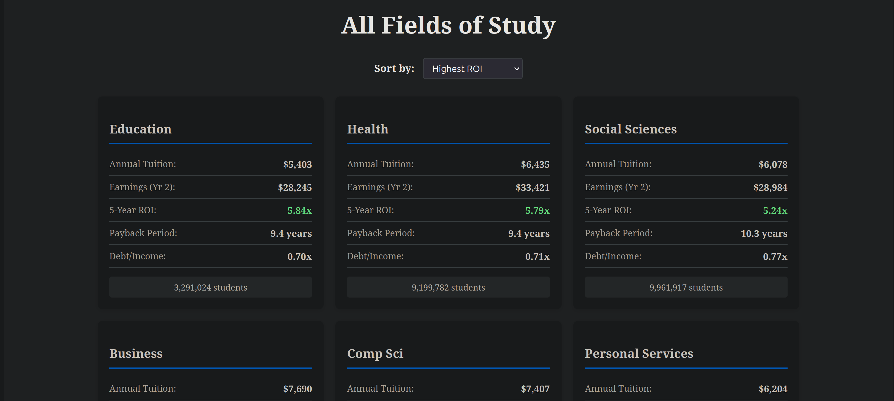
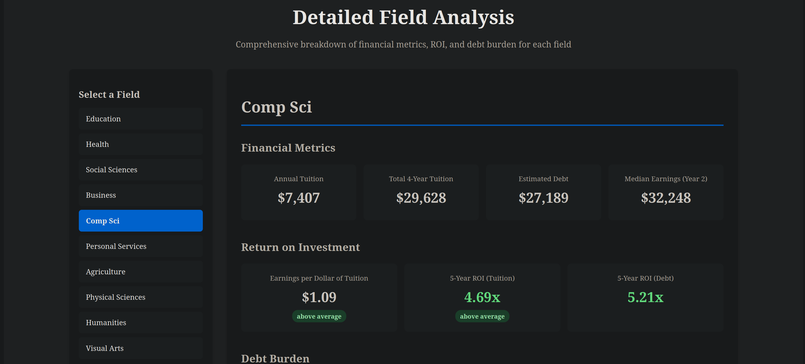
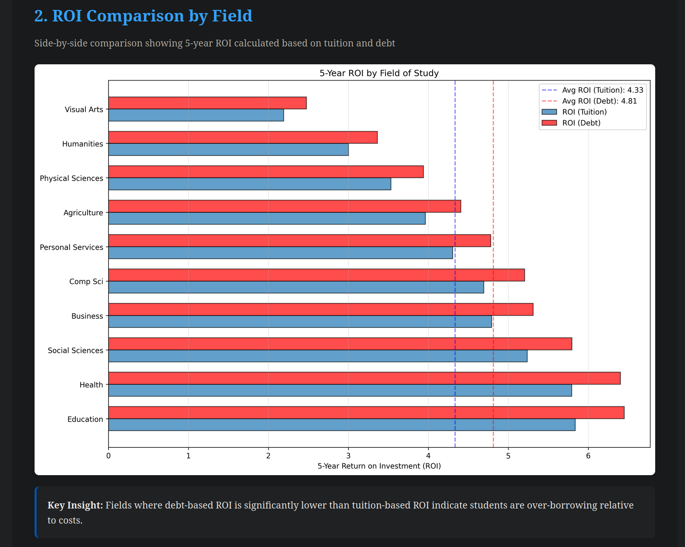

# Canadian University ROI Analysis Platform

A full-stack application analyzing the Return on Investment (ROI) for different fields of study at Canadian universities. This project combines data analysis, backend API development, and a modern frontend interface to provide insights into educational outcomes and student debt.

## Features

### Data Analysis

- Python-based ETL pipeline processing Statistics Canada data
- Automated report generation with visualizations
- ROI calculations with multiple methodologies
- Inflation-adjusted earnings data (2024 CAD)

### Backend (.NET 10)

- RESTful API with comprehensive endpoints
- Entity Framework Core with SQLite support
- Dependency injection architecture
- JSON-based reporting system
- Database-backed field data

### Frontend (React + TypeScript)

- Modern, responsive UI with React Router
- Interactive data tables with sorting capabilities
- Detailed field-by-field analysis
- Policy recommendations dashboard
- Data visualization displays
- Type-safe development with TypeScript

## Tech Stack

### Data Analysis

- **Python**
  - pandas
  - matplotlib
  - pytest

### Backend

- **C# / .NET 10**
  - ASP.NET Core
  - Entity Framework Core
  - SQLite
  - Swagger/OpenAPI documentation

### Frontend

- **React + TypeScript**
  - React Router
  - Axios
  - Component CSS
  - Vite

### Data Sources

- Statistics Canada Open Data Portal
  - Table 37-10-0003-01: Undergraduate tuition fees
  - Table 37-10-0280-01: Graduate employment income
  - Table 37-10-0011-01: Postsecondary enrollments
  - Table 37-10-0036-01: Student debt data

## Getting Started

### Prerequisites

- Python 3.8+
- .NET 10 SDK
- Node.js 18+
- npm

### Installation & Running

#### 1. Clone the Repository

```bash
git clone https://github.com/Ray-AS/canadian-university-roi-generator
cd canadian-university-roi-generator
```

#### 2. Set Up Python Environment

```bash
# Create virtual environment
python -m venv venv

# Activate virtual environment
# Windows:
venv\Scripts\activate
# macOS/Linux:
source venv/bin/activate

# Install dependencies
pip install -r requirements.txt
```

#### 3. Run Data Pipeline

```bash
# Fetch data and generate reports (ensure you are in root project folder)
python (or python3) -m services.main
```

This will:

- Download Statistics Canada data
- Process and normalize the data
- Calculate ROI metrics
- Generate visualizations
- Create JSON reports and markdown documentation

#### 4. Set Up Backend

```bash
cd backend

# Restore dependencies
dotnet restore

# Create database and seed data
dotnet ef database update

# Run the API
dotnet run
```

The API will be available at `http://localhost:5177` (BASE URL: `http://localhost:5177/api/report`)

Swagger documentation: `http://localhost:5177/swagger`

#### 5. Set Up Frontend

```bash
cd frontend

# Install dependencies
npm install

# Copy visualization images
mkdir -p public/figures
cp ../figures/*.png public/figures/

# Start development server
npm run dev
```

The application will open at `http://localhost:3000`

### Running Tests

```bash
pytest
```

## Methodology

### Data Sources

- **Statistics Canada Open Data**: Official government statistics
- **Inflation Adjustment**: CPI adjustments to 2024 CAD
- **Data Years**: 2018-2024 (various metrics)

### Key Assumptions

1. **Program Length**: 4-year undergraduate degree
2. **Earnings Growth**: 3% annually post-graduation
3. **Tax Rate**: 25% on income
4. **Debt Repayment**: 10% of post-tax income
5. **Interest Rate**: 0% (simplified model)

### Limitations

- Uses median earnings (not mean)
- Does not account for regional variation
- Excludes scholarships and grants
- Simplified debt repayment model
- Does not track career progression beyond Year 2

For detailed methodology, see [reports/REPORT.md](reports/REPORT.md)

## Screenshots

### Home Dashboard



### Field Rankings



### Detailed Analysis



### Data Visualizations


