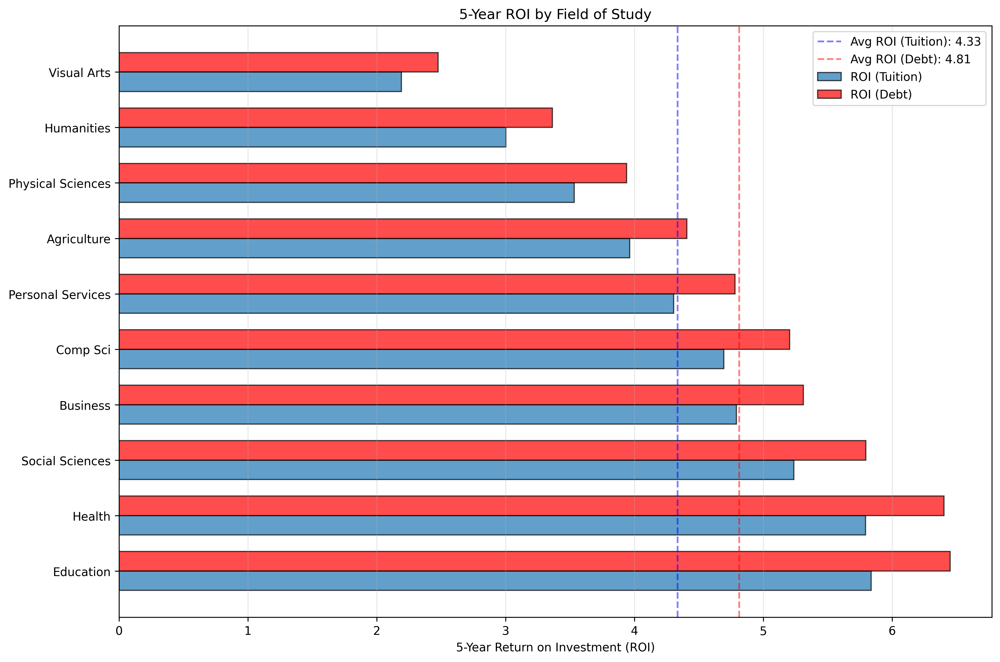

# Canadian University Education ROI Analysis Generator

A data analysis tool that calculates return on investment (ROI) for Canadian university education across different fields of study. Analyzes tuition costs, student debt, graduate earnings, and enrollment data to provide insights collated in a detailed report (`reports/REPORT.md`).

**View Automatically Generated Report:** [REPORT](./reports/REPORT.md)



## Tools

- **Languages:**
  - Python
- **Libraries:**
  - Pandas
  - Matplotlib
- **Testing:**
  - Pytest
- **Data Source:**
  - Statistics Canada

## Features

### Metrics

- **5-Year ROI** (calculated both by tuition and by debt)
- **Debt-to-Income Ratios** (repayment burden)
- **Payback Period** (years to repay debt at 10% of post-tax income)
- **Earnings per Dollar of Tuition** (value-for-money metric)
- **Enrollment-weighted Averages** (system-wide impact)

### Visualizations

1. **Tuition vs Earnings Chart** - Cost vs outcomes
2. **ROI Comparison by Field** - Tuition vs debt-based ROI
3. **Payback Period by Field** - Time to debt freedom
4. **Debt-to-Income Rankings** - Repayment burden by field

### Report

- Summary with key findings
- Field-by-field rankings (4 different metrics)
- Complete data table (all metrics)
- Plots of data and insights
- Detailed field analysis
- Policy recommendations

### Fields

10+ fields including: Agriculture, Business, Computer Science, Education, Health, Humanities, Personal Services, Physical Sciences, Social Sciences, Visual Arts

## Quick Start

### Prerequisites

- Python 3.10+

### Clone and Install Dependencies

```bash
git clone git@github.com:Ray-AS/student-debt-analysis.git
cd student-debt-analysis
pip install -r requirements.txt
```

### Run Analysis

```bash
# Generate cli outputs, plots, and report
python3 main.py
```

### Outputs

```bash
figures/
├── debt_to_income_ratio.png
├── payback_years.png
├── roi_by_field.png
└── tuition_vs_earnings.png

reports/
└── REPORT.md
```

## How It Works

1. **Data Fetching** (`fetch.py`)
   - Downloads CSV data from Statistics Canada
   - Caches locally to avoid redundant downloads
   - Filters to relevant years

2. **Data Preparation** (`normalization.py`, `preparation.py`)
   - Normalizes field names across different StatCan tables
   - Converts academic years (2020/2021) to integers
   - Adjusts for inflation (CPI 2018→2024, 2020→2024)

3. **ROI Calculation** (`calculation.py`)
   - Estimates debt proportional to tuition costs
   - Calculates 5-year cumulative earnings (3% annual growth)
   - Computes ROI, payback period, and value metrics

4. **Output Generation** (`plots.py`, `report.py`)
   - Creates 4 plots
   - Generates comprehensive markdown report

### Key Assumptions

- **Inflation**: CPI adjustment 2018→2024 (1.21x), 2020→2024 (1.14x)
- **Debt Estimation**: Proportional to tuition relative to national average
- **Earnings Growth**: 3% annually
- **Tax Rate**: 25%
- **Debt Repayment**: 10% of post-tax income
- **Program Length**: 4 years

See `reports/REPORT.md` → Methodology section for full details.

## Testing

Run the test suite:

```bash
pytest test_all.py -v
```

## Data Sources

All data from Statistics Canada (Open Government License):

| Dataset    | Table ID      | Description                                                   |
|------------|---------------|---------------------------------------------------------------|
| Tuition    | 37-10-0003-01 | Canadian and international tuition fees by level of study     |
| Earnings   | 37-10-0280-01 | Median earnings of post-secondary graduates by field of study |
| Debt       | 37-10-0036-01 | Student debt from government and non-government sources       |
| Enrollment | 37-10-0011-01 | Post-secondary enrollments by field of study                  |

**Data Years:**

- Tuition: 2023/2024
- Earnings: 2018 (inflation-adjusted to 2024)
- Enrollment: 2023/2024
- Debt: 2020 (inflation-adjusted to 2024)
