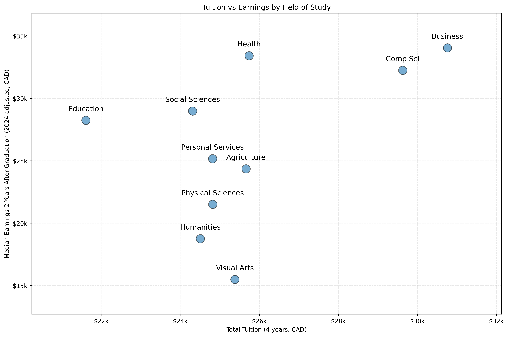
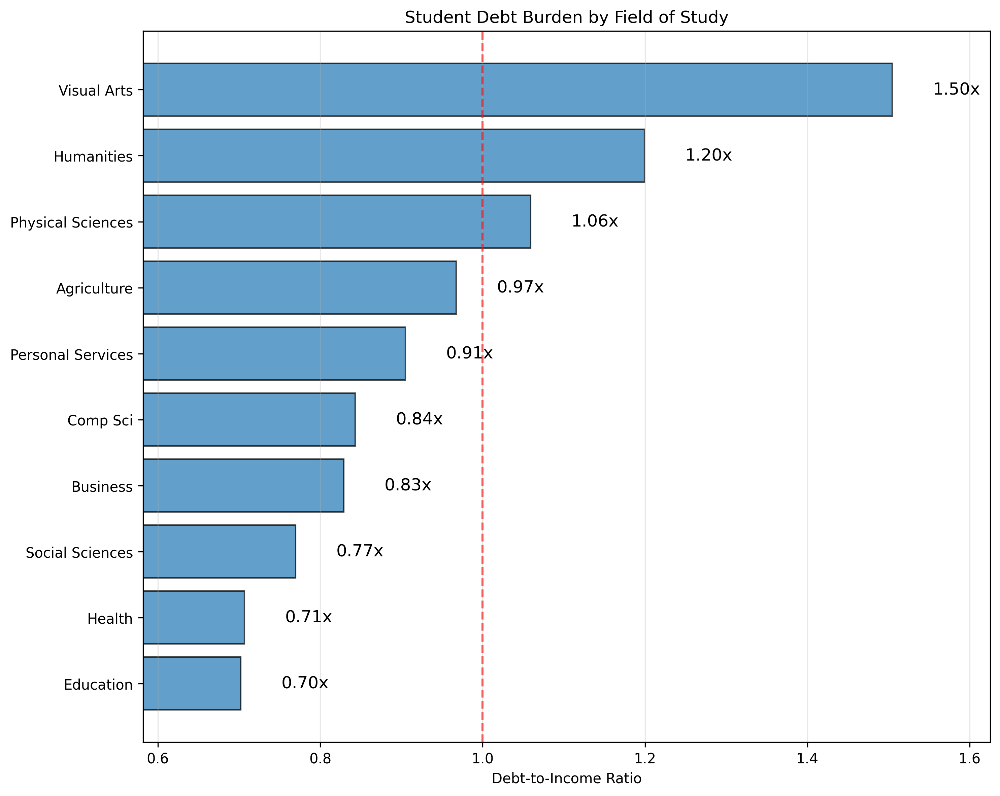

# Canadian University Education ROI Analysis

**Report Date:** January 30, 2026

## Visual Overview

This report includes the following data visualizations (see `figures/` directory):

1. **Tuition vs Earnings Chart** - Shows relationship between tuition costs and earnings (after 2 years)
2. **ROI Comparison by Field** - Side-by-side comparison of ROI of all fields
3. **Payback Period by Field** - Shows years required to repay debt at 10% of post-tax income
4. **Debt-to-Income Ratio Rankings** - Visualizes repayment burden across fields

## Key Findings

### Overall
- **Average Annual Tuition:** $6,431
- **Average Total Debt:** $23,606
- **Average Earnings (Year 2):** $26,219
- **Average 5-Year ROI:** 4.33x
- **Average Payback Period:** 12.6 years

### Best Performing Fields

**Highest ROI:** Education
- 5-Year ROI: 5.84x
- Annual Tuition: $5,403
- Median Earnings: $28,245

**Best Value for Money:** Education
- Earnings per Dollar: $1.31
- Annual Tuition: $5,403
- Median Earnings: $28,245

**Fastest Debt Payback:** Education
- Payback Period: 9.4 years
- Debt-to-Income: 0.70x

### Areas of Concern

**Lowest ROI:** Visual Arts
- 5-Year ROI: 2.19x
- Annual Tuition: $6,346
- Median Earnings: $15,481

**Lowest Value for Money:** Visual Arts
- Earnings per Dollar: $0.61
- Annual Tuition: $6,346
- Median Earnings: $15,481

**Slowest Debt Payback:** Visual Arts
- Payback Period: 20.1 years
- Debt-to-Income: 1.50x

---

## Field Rankings

### By 5-Year ROI (Tuition-Based)
1. **Education** - 5.84x
2. **Health** - 5.79x
3. **Social Sciences** - 5.24x
4. **Business** - 4.79x
5. **Comp Sci** - 4.69x
6. **Personal Services** - 4.30x
7. **Agriculture** - 3.96x
8. **Physical Sciences** - 3.53x
9. **Humanities** - 3.00x
10. **Visual Arts** - 2.19x

### By Earnings per Dollar of Tuition
1. **Education** - $1.31
2. **Health** - $1.30
3. **Social Sciences** - $1.19
4. **Business** - $1.11
5. **Comp Sci** - $1.09
6. **Personal Services** - $1.01
7. **Agriculture** - $0.95
8. **Physical Sciences** - $0.87
9. **Humanities** - $0.77
10. **Visual Arts** - $0.61

### By Debt-to-Income Ratio (Lower is Better)
1. **Education** - 0.70x
2. **Health** - 0.71x
3. **Social Sciences** - 0.77x
4. **Business** - 0.83x
5. **Comp Sci** - 0.84x
6. **Personal Services** - 0.91x
7. **Agriculture** - 0.97x
8. **Physical Sciences** - 1.06x
9. **Humanities** - 1.20x
10. **Visual Arts** - 1.50x

### By Payback Period (Faster is Better)
1. **Education** - 9.4 years
2. **Health** - 9.4 years
3. **Social Sciences** - 10.3 years
4. **Business** - 11.1 years
5. **Comp Sci** - 11.2 years
6. **Personal Services** - 12.1 years
7. **Agriculture** - 12.9 years
8. **Physical Sciences** - 14.1 years
9. **Humanities** - 16.0 years
10. **Visual Arts** - 20.1 years

---

## Data Table

| Field | Annual Tuition | Total Debt | Earnings (Yr 2) | ROI (Tuition) | ROI (Debt) | Debt-to-Income | Payback Years | Earnings/$ Tuition | Enrollment |
|-------|----------------|------------|-----------------|---------------|------------|----------------|---------------|-------------------|------------|
| Education | $5,403 | $19,833 | $28,245 | 5.84x | 6.45x | 0.70x | 9.4 yrs | $1.31 | 3,291,024 |
| Health | $6,435 | $23,621 | $33,421 | 5.79x | 6.40x | 0.71x | 9.4 yrs | $1.30 | 9,199,782 |
| Social Sciences | $6,078 | $22,310 | $28,984 | 5.24x | 5.80x | 0.77x | 10.3 yrs | $1.19 | 9,961,917 |
| Business | $7,690 | $28,227 | $34,047 | 4.79x | 5.31x | 0.83x | 11.1 yrs | $1.11 | 15,262,449 |
| Comp Sci | $7,407 | $27,189 | $32,248 | 4.69x | 5.21x | 0.84x | 11.2 yrs | $1.09 | 5,267,283 |
| Personal Services | $6,204 | $22,773 | $25,162 | 4.30x | 4.78x | 0.91x | 12.1 yrs | $1.01 | 1,553,295 |
| Agriculture | $6,416 | $23,551 | $24,344 | 3.96x | 4.41x | 0.97x | 12.9 yrs | $0.95 | 1,291,170 |
| Physical Sciences | $6,205 | $22,776 | $21,501 | 3.53x | 3.94x | 1.06x | 14.1 yrs | $0.87 | 6,194,085 |
| Humanities | $6,127 | $22,490 | $18,754 | 3.00x | 3.36x | 1.20x | 16.0 yrs | $0.77 | 7,677,327 |
| Visual Arts | $6,346 | $23,294 | $15,481 | 2.19x | 2.48x | 1.50x | 20.1 yrs | $0.61 | 2,774,625 |

---

## Data Visualizations

This report is accompanied by four key visualizations located in the `figures/` directory. Each visualization highlights different aspects of the ROI analysis:

### 1. Tuition vs Earnings Chart
**File:** `figures/tuition_vs_earnings.png`

Shows the relationship between total 4-year tuition costs and median earnings 2 years after graduation:
- Whether higher tuition translates to higher earnings
- Outliers in either direction (high cost/low earnings or low cost/high earnings)

**Key Insight:** Some of the lowest-tuition fields produce competitive earnings, suggesting strong value for students.

---

### 2. ROI Comparison by Field
**File:** `figures/roi_by_field.png`

Side-by-side comparison showing 5-year ROI calculated two ways:
- Based on total tuition paid
- Based on estimated debt incurred

Includes average ROI lines for both calculations. The gap between the two bars shows how debt burden affects returns.

**Key Insight:** Fields where debt-based ROI is significantly lower than tuition-based ROI indicate students are over-borrowing relative to costs.

---

### 3. Payback Period by Field
**File:** `figures/payback_years.png`

Shows estimated years to repay student debt assuming 25% tax rate on income and 10% of post-tax income goes to debt repayment. Converts abstract debt figures into time, which is more intuitive for students and families.

**Key Insight:** Fields requiring 15+ years for debt repayment may discourage students despite long-term career potential.

---

### 4. Debt-to-Income Ratio Rankings
**File:** `figures/debt_to_income_ratio.png`

Horizontal bar chart showing estimated debt as a multiple of annual earnings. A ratio above 1.0 means debt exceeds annual income. Lower is better.

**Key Insight:** Fields with ratios above 1.2x may face significant repayment stress and warrant financial aid attention.

---

## Field Analysis

### Education

**Financial Metrics:**
- Annual Tuition: $5,403
- Total 4-Year Tuition: $21,612
- Estimated Debt: $19,833
- Median Earnings (Year 2): $28,245

**Return on Investment:**
- Earnings per Dollar of Tuition: $1.31 (above average)
- 5-Year ROI (Tuition): 5.84x (above average)
- 5-Year ROI (Debt): 6.45x

**Debt Burden:**
- Debt-to-Income Ratio: 0.70x
- Estimated Payback Period: 9.4 years

**Enrollment:** 3,291,024 students

---

### Health

**Financial Metrics:**
- Annual Tuition: $6,435
- Total 4-Year Tuition: $25,740
- Estimated Debt: $23,621
- Median Earnings (Year 2): $33,421

**Return on Investment:**
- Earnings per Dollar of Tuition: $1.30 (above average)
- 5-Year ROI (Tuition): 5.79x (above average)
- 5-Year ROI (Debt): 6.40x

**Debt Burden:**
- Debt-to-Income Ratio: 0.71x
- Estimated Payback Period: 9.4 years

**Enrollment:** 9,199,782 students

---

### Social Sciences

**Financial Metrics:**
- Annual Tuition: $6,078
- Total 4-Year Tuition: $24,312
- Estimated Debt: $22,310
- Median Earnings (Year 2): $28,984

**Return on Investment:**
- Earnings per Dollar of Tuition: $1.19 (above average)
- 5-Year ROI (Tuition): 5.24x (above average)
- 5-Year ROI (Debt): 5.80x

**Debt Burden:**
- Debt-to-Income Ratio: 0.77x
- Estimated Payback Period: 10.3 years

**Enrollment:** 9,961,917 students

---

### Business

**Financial Metrics:**
- Annual Tuition: $7,690
- Total 4-Year Tuition: $30,760
- Estimated Debt: $28,227
- Median Earnings (Year 2): $34,047

**Return on Investment:**
- Earnings per Dollar of Tuition: $1.11 (above average)
- 5-Year ROI (Tuition): 4.79x (above average)
- 5-Year ROI (Debt): 5.31x

**Debt Burden:**
- Debt-to-Income Ratio: 0.83x
- Estimated Payback Period: 11.1 years

**Enrollment:** 15,262,449 students

---

### Comp Sci

**Financial Metrics:**
- Annual Tuition: $7,407
- Total 4-Year Tuition: $29,628
- Estimated Debt: $27,189
- Median Earnings (Year 2): $32,248

**Return on Investment:**
- Earnings per Dollar of Tuition: $1.09 (above average)
- 5-Year ROI (Tuition): 4.69x (above average)
- 5-Year ROI (Debt): 5.21x

**Debt Burden:**
- Debt-to-Income Ratio: 0.84x
- Estimated Payback Period: 11.2 years

**Enrollment:** 5,267,283 students

---

### Personal Services

**Financial Metrics:**
- Annual Tuition: $6,204
- Total 4-Year Tuition: $24,816
- Estimated Debt: $22,773
- Median Earnings (Year 2): $25,162

**Return on Investment:**
- Earnings per Dollar of Tuition: $1.01 (below average)
- 5-Year ROI (Tuition): 4.30x (below average)
- 5-Year ROI (Debt): 4.78x

**Debt Burden:**
- Debt-to-Income Ratio: 0.91x
- Estimated Payback Period: 12.1 years

**Enrollment:** 1,553,295 students

---

### Agriculture

**Financial Metrics:**
- Annual Tuition: $6,416
- Total 4-Year Tuition: $25,664
- Estimated Debt: $23,551
- Median Earnings (Year 2): $24,344

**Return on Investment:**
- Earnings per Dollar of Tuition: $0.95 (below average)
- 5-Year ROI (Tuition): 3.96x (below average)
- 5-Year ROI (Debt): 4.41x

**Debt Burden:**
- Debt-to-Income Ratio: 0.97x
- Estimated Payback Period: 12.9 years

**Enrollment:** 1,291,170 students

---

### Physical Sciences

**Financial Metrics:**
- Annual Tuition: $6,205
- Total 4-Year Tuition: $24,820
- Estimated Debt: $22,776
- Median Earnings (Year 2): $21,501

**Return on Investment:**
- Earnings per Dollar of Tuition: $0.87 (below average)
- 5-Year ROI (Tuition): 3.53x (below average)
- 5-Year ROI (Debt): 3.94x

**Debt Burden:**
- Debt-to-Income Ratio: 1.06x
- Estimated Payback Period: 14.1 years

**Enrollment:** 6,194,085 students

---

### Humanities

**Financial Metrics:**
- Annual Tuition: $6,127
- Total 4-Year Tuition: $24,508
- Estimated Debt: $22,490
- Median Earnings (Year 2): $18,754

**Return on Investment:**
- Earnings per Dollar of Tuition: $0.77 (below average)
- 5-Year ROI (Tuition): 3.00x (below average)
- 5-Year ROI (Debt): 3.36x

**Debt Burden:**
- Debt-to-Income Ratio: 1.20x
- Estimated Payback Period: 16.0 years

**Enrollment:** 7,677,327 students

---

### Visual Arts

**Financial Metrics:**
- Annual Tuition: $6,346
- Total 4-Year Tuition: $25,384
- Estimated Debt: $23,294
- Median Earnings (Year 2): $15,481

**Return on Investment:**
- Earnings per Dollar of Tuition: $0.61 (below average)
- 5-Year ROI (Tuition): 2.19x (below average)
- 5-Year ROI (Debt): 2.48x

**Debt Burden:**
- Debt-to-Income Ratio: 1.50x
- Estimated Payback Period: 20.1 years

**Enrollment:** 2,774,625 students

---

## Methodology & Assumptions

### Data Sources
All data sourced from Statistics Canada tables:
- **Table 37-10-0003-01:** Canadian undergraduate tuition fees by field of study (current dollars)
- **Table 37-10-0280-01:** Characteristics and median employment income of longitudinal cohorts of postsecondary graduates two and five years after graduation, by educational qualification and field of study (alternative primary groupings)
- **Table 37-10-0011-01:** Postsecondary enrolments, by field of study, registration status, program type, credential type and gender
- **Table 37-10-0036-01:** Student debt from all sources, by province of study and level of study

### Key Assumptions

#### Inflation Adjustment
- CPI adjustment (2018 to 2024): 1.21
- CPI adjustment (2020 to 2024): 1.14

#### Debt Estimation
- Average national debt used as baseline
- Debt estimated for each field proportional to tuition costs
    - **Debt for Field:** (tuition cost for field / average tuition cost) * average national debt
- Assumes standard 4-year undergraduate program

#### ROI Calculation
- Amount earned over 5 years (minus tuition costs) compared to amount paid for tuition
- Assumes 3% annual earnings growth
- Based on median earnings 2 years post-graduation
- **5-Year ROI (Tuition):** (5-year cumulative earnings - total tuition) / total tuition
- **5-Year ROI (Debt):** (5-year cumulative earnings - estimated debt) / estimated debt

#### Payback Period Calculation
- Assumes 10% of post-tax income dedicated to debt repayment
- Tax rate assumed at 25%
- No interest on debt (simplified)
- **Post-tax Income:** median earnings * (1 - tax-rate) [tax rate assumed to be 25%]
- **Payback Years:** debt for field / (post-tax income * % of income to debt repayment) [% to debt repayment assumed to be 10%]

#### Earnings per Dollar
- Shows immediate earning potential relative to investment
- **Earnings per Dollar:** median annual earnings (year 2) / total 4-year tuition

### Limitations
- Earnings data represents median, not mean (outliers not reflected)
- Does not account for:
  - Regional variation in tuition or earnings
  - Graduate vs undergraduate distinctions in some fields
  - Scholarships, grants, or other financial aid
  - Career progression beyond Year 2
  - Job market saturation or demand
  - Individual career choices and performance

### Data Years
- Tuition: 2023/2024 academic year
- Earnings: 2018 (inflation-adjusted to 2024)
- Enrollment: 2023/2024 academic year
- Debt: 2020 (inflation-adjusted to 2024)

---

## Policy Recommendations

### Areas Requiring Attention

#### High Enrollment, Low ROI Fields
These fields serve many students but show below-median returns:

- **Humanities**: 7,677,327 students, ROI 3.00x
- **Physical Sciences**: 6,194,085 students, ROI 3.53x

**Recommendations:**
- Review tuition pricing structures for these programs
- Enhance career counseling and job placement services
- Consider industry partnerships to improve employment outcomes
- Develop financial literacy programs for students in these fields

#### High Debt Burden Fields
- **Visual Arts**: Debt-to-Income 1.50x, Payback 20.1 years
- **Humanities**: Debt-to-Income 1.20x, Payback 16.0 years
- **Physical Sciences**: Debt-to-Income 1.06x, Payback 14.1 years

**Recommendations:**
- Expand scholarship and grant programs for these fields
- Review whether tuition costs are justified by earnings potential
- Consider capping debt levels for students in these programs

### Best Practices to Expand

#### High-Performing Models
Fields showing strong ROI and reasonable debt burdens can serve as models:

- **Education**: ROI 5.84x, Debt-to-Income 0.70x
- **Health**: ROI 5.79x, Debt-to-Income 0.71x
- **Social Sciences**: ROI 5.24x, Debt-to-Income 0.77x

**Recommendations:**
- Study successful curriculum and industry partnership models
- Promote these fields to students considering post-secondary education

### System-Wide Improvements

1. **Transparency:** Provide prospective students with clear ROI data before enrollment
2. **Affordability:** Review tuition increases relative to earnings outcomes
3. **Accountability:** Track and publish graduate outcomes by program
4. **Support:** Enhance financial aid for high-social-value, lower-earning fields
5. **Flexibility:** Develop more affordable pathway options (e.g., co-op, apprenticeship models)

---

---

**Report Generated:** January 30, 2026 at 05:52 PM

**Data Sources:** Statistics Canada Tables 37-10-0003-01, 37-10-0280-01, 37-10-0011-01, 37-10-0036-01

For questions or additional analysis, please refer to the accompanying visualizations and raw data files.
